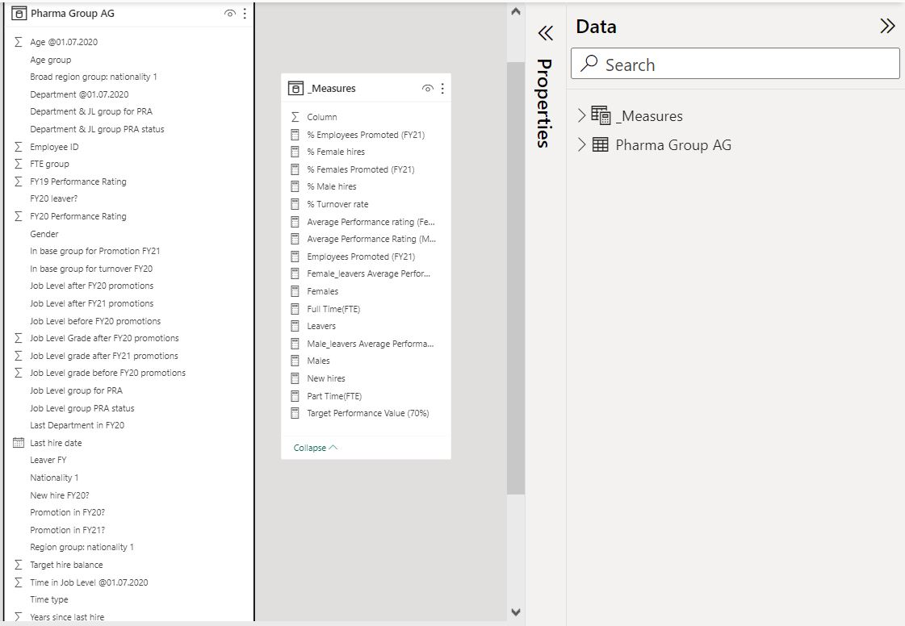
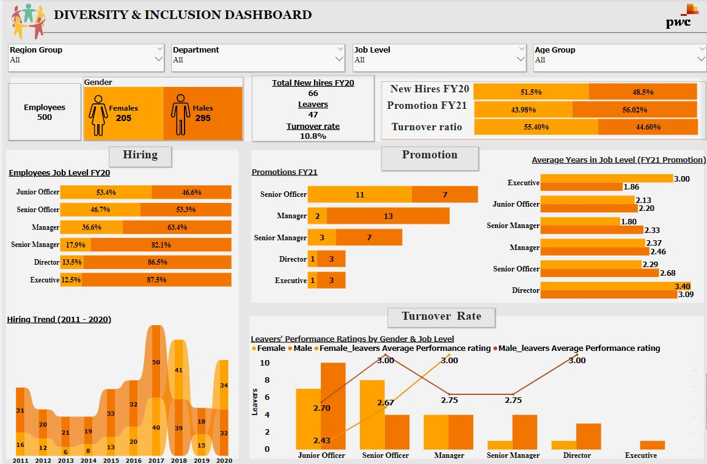
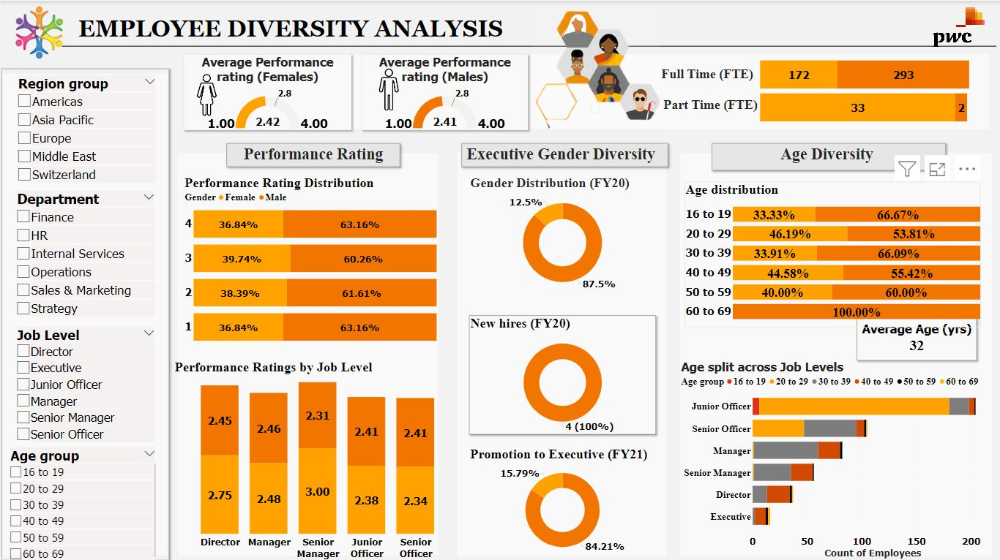
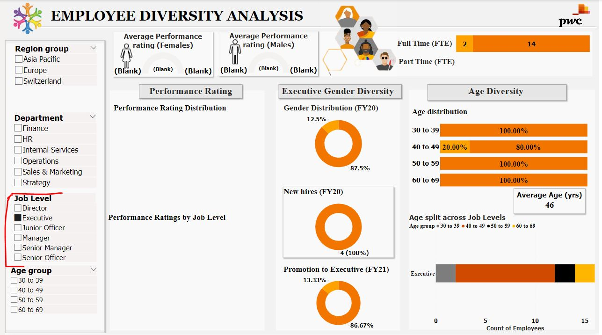

# PwC Switzerland Power BI Virtual Case Experience (3/3) –Diversity & Inclusion

 
[Photo_Credit](https://www.istockphoto.com/photos/gender-balance-workplace)
## Background
Companies need a workforce of diverse talents and backgrounds to succeed in an increasingly complex and heterogeneous world. Human Resources at our telecom client is highly into diversity and inclusion. They’ve been working hard to improve gender balance at the executive management level, but they’re not seeing any progress. After, presenting the [Customer Retention](https://github.com/Analyst-Joan/Customer-Retention%20) analysis report,  Analyst-Joan is poised to provide insights and action that can help our client achieve their goal of **Gender Balance in the Executive Suite**

## About the Data
The dataset is a Microsoft Excel file that contains one table, consisting of **500 rows and 32 columns** of the Employees hiring records and performance. The data was gotten from [Forage]( https://cdn.theforage.com/vinternships/companyassets/4sLyCPgmsy8DA6Dh3/03%20Diversity-Inclusion-Dataset.xlsx).   

## Client’s Need 
A Power BI dashboard that reflects all relevant Key Performance Indicators (KPIs) and metrics in hiring, promotion, performance and turnover, as well as Insights (findings on what the root causes of their slow progress might be) and recommendations.

## Target Audience
-	The Human Resource Manager

## Skills/Concepts applied
-	Defining KPIs
-	Cleaning/Validation in Power Query
-	Power BI DAX Concepts: Calculated Measures
-	Data Visualization in Power BI
-	Power BI Dashboard building
-	Filters and Slicers.
-	Insights & Actions

## Data Transformation/Preprocessing
The dataset was imported into Power BI’s Power Query for data validation and cleaning.  The column profiling was changed from ‘based on Top 1000 rows’ to ‘based on entire dataset’. ‘Column quality’ and ‘Column distribution’ checkboxes were selected to get a summary information about each column for effective cleaning/Preprocessing. The process is as outlined below:
-	Column datatypes were validated appropriately.
-	Null values were replaced with N/A or 0 depending on the column feature.
-	Abbreviated values were expanded, e.g., “Y” replaced with “Yes”.
-	Columns with Job grade and level together were split into 2 different columns.
-	Redundant columns were removed.
- FTE column was harmonised by replacing "Full-time" with 1.0, to match the numeric pattern used for part-time work hours.
  
## Data Modelling
This was not applicable as the dataset has only one table. However, for Enhanced reusability, Improved data model organization and Increased performance, a **measures table** was created to store calculated measures.


 

## Data Exploration / KPI Visualization.
With the data now processed, it’s time to explore the data. We’ll analyze relevant KPIs, which will include data-driven insights that are critical to the organization's success, visualize findings, and show Gender ratio in the Executive Suite. 

### Analyzing Gender Diversity and Inclusion
To analyze and visualize metrics that show gender ratios in hiring, promotion, and turnover rate, the following measures were first computed:
```
Females = CALCULATE(
                   COUNT('Pharma Group AG'[Employee ID]),
                         'Pharma Group AG'[Gender] = "Female")
```
```
Males = CALCULATE(
                 COUNT('Pharma Group AG'[Employee ID]),
                       'Pharma Group AG'[Gender] = "Male")
```
```
New hires = CALCULATE(
                     COUNT('Pharma Group AG'[New hire FY20?]),
                           'Pharma Group AG'[New hire FY20?]="Yes")
```
```
Leavers = CALCULATE(
                  COUNT('Pharma Group AG'[FY20 leaver?]),
                        'Pharma Group AG'[FY20 leaver?] = "Yes")
```
```
% Turnover rate = DIVIDE(
                         CALCULATE(
                                  COUNT('Pharma Group AG'[FY20 leaver?]),
                                        'Pharma Group AG'[FY20 leaver?] = "Yes"),
                         CALCULATE(
                                   COUNT('Pharma Group AG'[Employee ID]),
                                          'Pharma Group AG'[New hire FY20?] ="No"))
```
```
Female_leavers Average Performance rating = 
                         CALCULATE(
                               AVERAGE('Pharma Group AG'[FY20 Performance Rating]),
                                       'Pharma Group AG'[Gender]="Female",
                                       'Pharma Group AG'[FY20 leaver?]="Yes")
```
```
Male_leavers Average Performance rating = 
                             CALCULATE(
                                     AVERAGE('Pharma Group AG'[FY20 Performance Rating]),
                                              'Pharma Group AG'[Gender]="Male",
                                                'Pharma Group AG'[FY20 leaver?]="Yes")
```
```
Employees Promoted (FY21) = CALCULATE(
                                  COUNT('Pharma Group AG'[Promotion in FY21?]),
                                        'Pharma Group AG'[Promotion in FY21?]="Yes")
```
```
% Employees Promoted (FY21) = DIVIDE(
                                    CALCULATE(
                                           COUNT('Pharma Group AG'[Promotion in FY21?]),
                                                 'Pharma Group AG'[Promotion in FY21?]="Yes"),
                                      COUNT('Pharma Group AG'[Employee ID]))
```
The measures were then used alongside other relevant records to visualize the metrics and create the dashboard shown below:


 
**Findings from the above dashboard**

•	The current workforce comprises of 500 employees, of which 59% (295) are males and 205(41%) are females.

•	The hiring trend shows that **more males were hired over females each year**, with an exception of only 2 years – 2018 & 2020. This is a possible reason for the gender inequality. 
As at 2020 Fiscal year(FY20),  over 80% of the top 3 job role levels were occupied by males.

•	In FY20 hiring, there is a slight shift in the stats, with **51.5% new hires being females, and 48.5% being males** – a likely attempt in achieving gender balance.😎
However, during promotion in 2021 Fiscal year (FY21), **over 50% of the promoted employees were males, with females accounting for a little over 43% of that**🤦‍♀️.

•	Similarly, **across the top tier job levels, over 70% are males**, with only the senior officer level have more of female promoted into it. What could be the reason for this imbalance?🤔🤔🤔 Let’s see if the number of years on the job is the factor.

•	Looking at the average years in the Job, **the few females that made it to the Director & Executive level actually spent more years in the Job than their male counterparts**. Hmmm🤔😐😐…what then is the promotion criteria? Is it Performance? or work hours? we will analyze this further, but first, let’s see the impact on the employee turnover.

•	**Out of the 47 employees that left, 55.4% are females, and 44.6% are males** – a likely outcome of the slow career growth for the females. Interestingly, **the leavers within the top Job levels (Senior Manager & Director) were only males**.

### Employee Diversity Analysis
Moving on, we will now assess the employees’ performance ratings, Executive gender diversity, and age diversity with focus on gender difference in each category, while also analyzing the work hours(Full Time Equivalent(FTE). The following additional measures were computed to analyze the metrics:
```
Average Performance rating (Females) = CALCULATE(
                                               AVERAGE('Pharma Group AG'[FY20 Performance Rating]),
                                                     'Pharma Group AG'[Gender]="Female")
```
```
Average Performance Rating (Males) = CALCULATE(
                                           AVERAGE('Pharma Group AG'[FY20 Performance Rating]),
                                                     'Pharma Group AG'[Gender]="Male")
```
```
Target Performance Value (70%) = MAX('Pharma Group AG'[FY20 Performance Rating]) * 0.7
```
```
Full Time(FTE) = CALCULATE(COUNT('Pharma Group AG'[Employee ID]),
                                   'Pharma Group AG'[FTE group] =1)
```
```
Part Time(FTE) = CALCULATE(COUNT('Pharma Group AG'[Employee ID]),
                                   'Pharma Group AG'[FTE group] <1)
```
The measures were then used alongside other relevant records to visualize the metrics and create the dashboard shown below:



 
**Findings from the Employee diversity analysis dashboard above**

•	Female employees have higher performance than their male colleagues across all Job levels, yet the gender balance at the executive suite remains tilted towards the males. Although there was about 3% increase in the females in FY21, all new Executive hires were males. This could indicate that performance was not part of the promotion criteria. 

•	Now, to the work hours: we see that there are more males working Full time than females, with the females accounting for over 90% of the part time employees. Aha!💡😀💡 Perhaps, availability to commit more work hours to the business has been the major hiring and promotion criteria. Let’s dive in further, to see if Age is a criterion?🤔

•	When the Job level filter is set to Executive level (as shown  below), we see that the age range for being in the Executive is from 30yrs and above, and females are represented across most of the Age groups, hence Age may not be a major criterion. 
It also shows that **all employees at the Executive suite are Full time employees**. 😎👌



## Recommendations to Drive Performance and Gender Balance at the Executive Level (KPI):
Now we know the possible root cause of the Gender imbalance to be work hours, here’s what can be done:
1. **Implement Performance-Based Promotion Criteria:**
-	Develop and implement clear, performance-based promotion criteria for all employees, including those at the Executive level. These criteria should take into account the higher performance levels of female employees observed in the analysis.
-	Establish transparent metrics and benchmarks for promotions, ensuring that promotions are awarded based on merit and performance achievements.
-	Regularly review and update these criteria to maintain fairness and objectivity.

  **_Potential KPIs_**
-	**Promotion Rate by Gender:** Measure the percentage of promotions by gender over time. This KPI will show whether more women are being promoted as a result of performance-based promotion criteria.
-	**Promotion Criteria Alignment:** Create a scorecard or checklist to assess how well promotions align with the established performance-based criteria. Track the percentage of promotions that align with these criteria.
-	**Employee Performance Scores:** Monitor and track the performance scores of male and female employees. Compare the average performance scores of these groups to ensure that promotions are indeed based on merit.

2. **Diversity and Inclusion Initiatives:**
-	Launch diversity and inclusion initiatives specifically aimed at increasing the representation of women in executive roles.
-	Create mentorship and sponsorship programs that pair high-potential female employees with executive-level mentors to support their career growth.
-	Promote a workplace culture that values diversity, equity, and inclusion, and ensure that these values are reflected in all aspects of the organization, including leadership.

  **_Potential KPIs_**
-	**Representation in Leadership Roles:** Measure the percentage of women in executive-level roles regularly. Set targets for increasing this percentage over time.
-	**Mentorship and Sponsorship Engagement:** Track the number of female employees participating in mentorship and sponsorship programs. Assess their career progression and development against those who are not participating.
-	**Employee Satisfaction Survey Scores:** Include questions related to diversity and inclusion in employee satisfaction surveys. Measure the scores and track improvements over time.

3. **Flexible Work Arrangements:**
-	Recognize that female employees make up the majority of part-time workers. Consider implementing flexible work arrangements that allow employees, especially women, to balance their work commitments with other responsibilities.
-	Encourage full-time employees to explore flexible work options, such as remote work or adjusted schedules, to attract and retain a diverse talent pool.

  **_Potential KPIs_**
-	**Utilization of Flexible Work Options:** Monitor the utilization of flexible work arrangements, such as part-time work, remote work, and adjusted schedules. Measure the percentage of employees, especially women, who take advantage of these options.
-	**Retention Rate of Employees Using Flexible Work:** Track the retention rate of employees who use flexible work arrangements. Are they more likely to stay with the organization compared to those who do not?

4. **Monitoring and Reporting:**
-	Continuously monitor the progress of gender balance initiatives and the impact of performance-based promotion criteria.
-	Regularly report on key diversity and inclusion metrics, including the number of women in executive roles, promotions, and employee satisfaction.
-	Use data-driven insights to refine and adapt strategies as needed.

  **_Potential KPIs_**
-	**Diversity Metrics Dashboard:** Create a diversity metrics dashboard that provides real-time data on gender diversity, promotions, and inclusion efforts. Regularly update and share this dashboard with key stakeholders.
-	**Progress Toward Goals:** Establish specific diversity and inclusion goals, such as increasing the percentage of women in executive roles by a certain percentage within a defined timeframe. Measure progress toward these goals

5. **Leadership Commitment:**
-	Ensure that leadership is committed to and actively involved in driving diversity and inclusion efforts.
-	Hold leaders accountable for promoting diversity and equity within their teams and departments.
-	Communicate the organization's commitment to diversity and inclusion both internally and externally.

  **_Potential KPIs_**
-	**Leadership Engagement:** Measure the engagement and commitment of organizational leaders to diversity and inclusion initiatives. Use surveys or interviews to assess their involvement and support.
-	**Leadership Accountability:** Track whether leaders are held accountable for promoting diversity and equity within their teams. Measure their success in achieving diversity-related goals within their departments.

## Conclusion
The specific and actionable recommendations, as well as measurable KPIs I’ve provided above, will help the Human Resource Manager work towards addressing the gender imbalance issue more effectively, track progress and ensure accountability, while fostering a workplace culture that values performance, diversity, and inclusion. The dashboard can be interacted with [Here](https://drive.google.com/file/d/19Gwfo4zSzWztRuIrEZY4jSOMofg60e-r/view?usp=sharing) 


